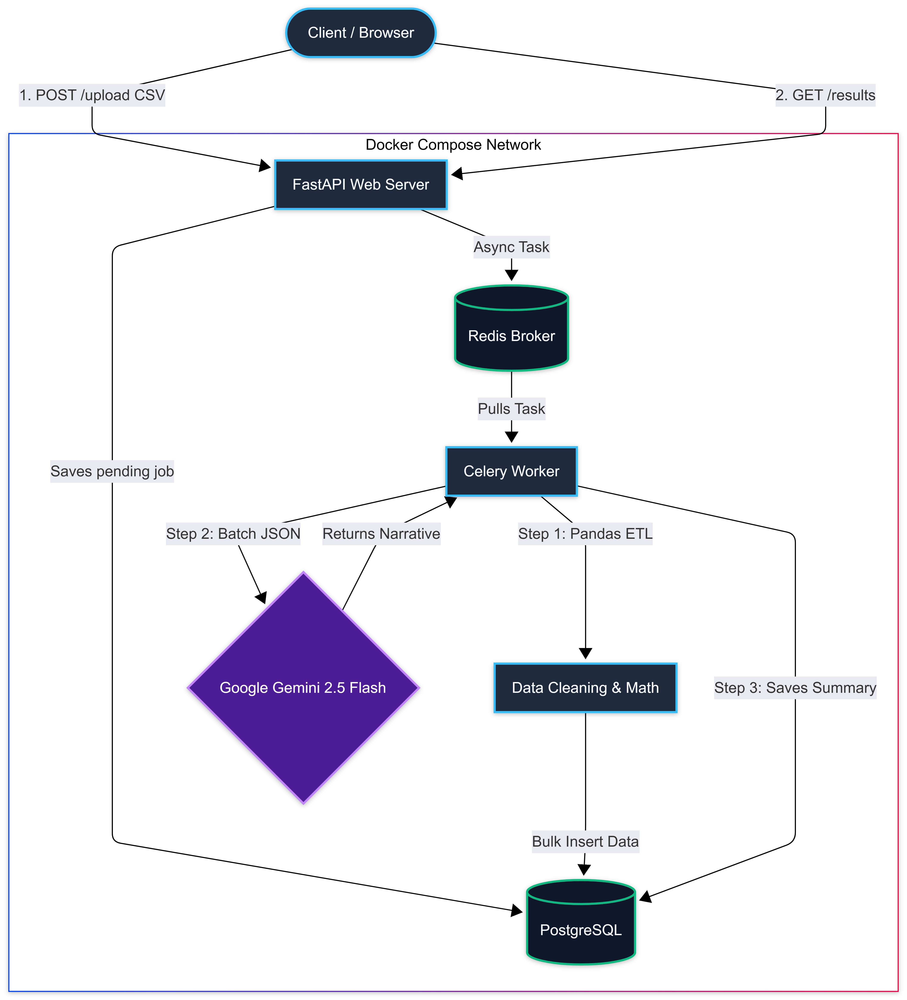

# AIONYX Engine: Financial ETL & Anomaly Detection Pipeline

     

The **AIONYX Engine** is a production-grade, asynchronous Financial ETL (Extract, Transform, Load) and Anomaly Detection pipeline. Designed to process massive, messy, multi-currency transaction ledgers, it utilizes a decoupled microservices architecture to clean data, detect statistical anomalies, and leverage Large Language Models (LLMs) to generate actionable financial risk assessments.

---

## 📊 High-Level System Architecture

*(The diagram below illustrates the asynchronous data flow through the Docker network)*



---

## 🚀 Core Capabilities

1. **Asynchronous Ingestion (Non-Blocking):** Heavy CSV files are ingested via FastAPI and immediately handed off to a Redis-backed Celery message queue, returning an instant `202 Accepted` response to the client.
2. **Intelligent ETL & Data Cleansing:** Pandas-driven workers programmatically strip corrupt characters, standardize ISO datetimes, and dynamically track multi-currency pools (INR and USD) without losing fractional precision.
3. **Statistical Anomaly Isolation:** The engine calculates median vendor spend limits and flags transactions that breach standard deviation thresholds (e.g., >3x median spend) or violate geographic currency rules.
4. **GenAI Categorization & Narrative (Gemini 2.5 Flash):** Uncategorized transactions are batched and sent to Google's LLM with strict JSON schema enforcement to determine merchant categories and generate a contextual, executive-level financial risk narrative.
5. **Interactive Matrix Dashboard:** Includes a modern, glassmorphic UI that uses vanilla JavaScript polling to hydrate real-time job statuses and tabular spend data directly from the API.

---

## 🛠️ Technology Stack

| Layer | Technology | Purpose |
| :--- | :--- | :--- |
| **API Web Server** | FastAPI | High-performance, async-native routing and payload validation. |
| **Task Queue** | Celery | Distributed background worker framework. |
| **Message Broker** | Redis | In-memory datastore for rapid task brokering. |
| **Database** | PostgreSQL 15 | Relational persistence for Jobs, Transactions, and Summaries. |
| **Data Processing** | Pandas | Vectorized mathematics and dataframe manipulation. |
| **AI Intelligence** | Google GenAI SDK | `gemini-2.5-flash` model for zero-shot JSON categorization. |
| **DevOps** | Docker Compose | 1-click containerized environment orchestration. |

---

## 📡 REST API Reference

The application exposes the following endpoints. Interactive documentation is available at `http://127.0.0.1:8000/docs`.

### 1. Upload Data
* **`POST /jobs/upload`**
* **Consumes:** `multipart/form-data` (CSV file)
* **Returns:** `job_id` and confirmation message.

### 2. Check Pipeline Status
* **`GET /jobs/{job_id}/status`**
* **Returns:** Current state (`pending`, `processing`, `completed`, `failed`) and high-level KPI math.

### 3. Retrieve Final Results
* **`GET /jobs/{job_id}/results`**
* **Returns:** The complete JSON payload including the AI-generated risk narrative, anomaly counts, and the array of fully cleaned transaction row objects.

### 4. List All Jobs
* **`GET /jobs`**
* **Query Params:** `?status=completed` (optional)
* **Returns:** Array of all historical jobs processed by the system.

---

## 💾 Database Schema

The pipeline utilizes SQLAlchemy ORM with two primary relational models:

* **`Job` Model:** Tracks the lifecycle of an uploaded file.
  * Columns: `id`, `filename`, `status`, `row_count_raw`, `row_count_clean`, `created_at`, `updated_at`.
  * *One-to-One Relation:* `JobSummary` (Contains the AI narrative and total metrics).
* **`Transaction` Model:** Stores individual financial records.
  * Columns: `id`, `job_id` (FK), `date`, `merchant`, `amount`, `currency`, `category`, `status`, `is_anomaly`, `anomaly_reason`.

---

## ⚡ 1-Click Deployment Guide

### Prerequisites
* Docker Desktop installed and running.
* A valid Google Gemini API Key.

### 1. Environment Setup
Clone the repository and create an environment variable file:
```bash
git clone [https://github.com/mayankvispute7/alemeno-tx-pipeline.git](https://github.com/mayankvispute7/alemeno-tx-pipeline.git)
cd alemeno-tx-pipeline
